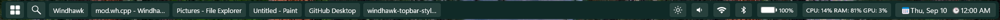

# GreenBar theme for TopBar For Windows Mod

This Theme makes the TopBar Dark Green.

**Author**: [WasiXGamer](https://github.com/wasixgamer)




## Installation

To import the theme styles:

* Open the TopBar for Windows mod in Windhawk.
* Go to the "Settings" tab and select "Textual mode".
* Copy the content below to the text box and click "Save settings".

<details>
<summary>Content to import (click to expand)</summary>

```yaml

  controlStyles:
    - target: TopBarRoot
      styles:
        - Background:=#102A27

    - target: StartButton
      styles:
        - Background:=#27403C

    - target: SearchButton
      styles:
        - Background:=#27403C

    - target: ClockButton
      styles:
        - Background:=#27403C

    - target: DisplayButton
      styles:
        - Background:=#27403C

    - target: SoundButton
      styles:
        - Background:=#27403C

    - target: WifiButton
      styles:
        - Background:=#27403C
    - target: BatteryButton
      styles:
        - Background:=#27403C
    - target: BluetoothButton
      styles:
        - Background:=#27403C

    - target: TrayButton
      styles:
        - Background:=#27403C

    - target: TaskButton
      styles:
        - Background:=#27403C

```
</details>
