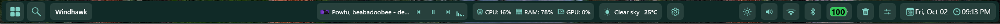

# GreenBar theme for TopBar For Windows Mod

This Theme makes the TopBar Dark Green.

**Author**: [WasiXGamer](https://github.com/wasixgamer)




## Installation

To import the theme styles:

* Open the TopBar for Windows mod in Windhawk.
* Go to the "Settings" tab and select "Textual mode".
* Copy the content below to the text box and click "Save settings".

<details>
<summary>Content to import (click to expand)</summary>

```yaml

controlStyles:
  - target: TopBarRoot
    styles:
<<<<<<< HEAD
      - 'Background:=#102A27'
      - 'IconColor=#7FD1C4'

  - target: WeatherButton
    styles:
      - 'Background:=#27403C'

  - target: RecycleBinButton
    styles:
      - 'Background:=#27403C'

  - target: SettingsButton
    styles:
      - 'Background:=#27403C'

  - target: StartButton
    styles:
      - 'Background:=#27403C'

  - target: SearchButton
    styles:
      - 'Background:=#27403C'

  - target: ClockButton
    styles:
      - 'Background:=#27403C'

  - target: DisplayButton
    styles:
      - 'Background:=#27403C'

  - target: SoundButton
    styles:
      - 'Background:=#27403C'

  - target: WifiButton
    styles:
      - 'Background:=#27403C'

  - target: BluetoothButton
    styles:
      - 'Background:=#27403C'

  - target: ResourceButton
    styles:
      - 'Background:=#27403C'

  - target: BatteryButton
    styles:
      - 'Background:=#27403C'

  - target: ControlCenterButton
    styles:
      - 'Background:=#27403C'

  - target: TaskButton
    styles:
      - 'Background:=#27403C'

  - target: AppTitleButton
    styles:
      - 'Background:=#27403C'

  - target: MediaButton
    styles:
      - 'Background:=#27403C'

  - target: MediaTransportButton
    styles:
      - 'Background:=#1B2E2B'

  - target: 'Canvas > FlyoutPresenter > Grid > Border#PART_BackgroundBorder'
    styles:
      - 'IconColor=#7FD1C4'
      - 'Background:=#1B2E2B'

=======
      - Background:=#102A27
  - target: Canvas > MenuFlyoutPresenter > Grid > Border#PART_BackgroundBorder
    styles:
      - Background:=#1B2E2B
  - target: Canvas > FlyoutPresenter > Grid > Border#PART_BackgroundBorder
    styles:
      - IconColor=#7FD1C4
      - Background:=#1B2E2B
>>>>>>> 1b8f46271a8dbb08c76a8d59b0dc1aa6bb3e24cb
  - target: FlyoutBlurHost
    styles:
      - 'Background:=#1B2E2B'

  - target: 'Canvas > MenuFlyoutPresenter > Grid > Border#PART_BackgroundBorder'
    styles:
      - 'Background:=#1B2E2B'

  - target: WifiHeaderToggle
    styles:
      - Width=50

  - target: BluetoothHeaderToggle
    styles:
      - Width=50

```
</details>
