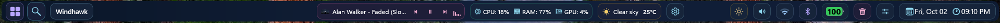

# Midnight Neon theme for TopBar For Windows Mod

This Theme makes the TopBar Dark Green.

**Author**: [WasiXGamer](https://github.com/wasixgamer)




## Installation

To import the theme styles:

* Open the TopBar for Windows mod in Windhawk.
* Go to the "Settings" tab and select "Textual mode".
* Copy the content below to the text box and click "Save settings".

<details>
<summary>Content to import (click to expand)</summary>

```yaml

controlStyles:
  - target: TopBarRoot
    styles:
      - Width=Auto
      - 'Background:=<LinearGradientBrush StartPoint="0,0" EndPoint="1,0"><GradientStop Offset="0" Color="#0A1628"/><GradientStop Offset="0.5" Color="#12203A"/><GradientStop Offset="1" Color="#0E1B33"/></LinearGradientBrush>'
      - 'IconColor=#8FD9F0'
      - CornerRadius=12

  - target: StartButton
    styles:
      - 'Background:=#182038'
      - 'BorderBrush:=#55A78BFA'
      - BorderThickness=1
      - CornerRadius=10
      - 'IconColor=#B8A5FF'

  - target: SearchButton
    styles:
      - 'Background:=#182038'
      - 'BorderBrush:=#556EE7F9'
      - BorderThickness=1
      - CornerRadius=10
      - 'IconColor=#8FD9F0'

  - target: ResourceButton
    styles:
      - 'Background:=#16243A'
      - 'BorderBrush:=#4434D399'
      - BorderThickness=1
      - CornerRadius=10
      - 'IconColor=#7FE0BC'

  - target: WeatherButton
    styles:
      - 'Background:=#182038'
      - 'BorderBrush:=#44FBBF24'
      - BorderThickness=1
      - CornerRadius=10
      - 'IconColor=#F5CE6B'

  - target: SettingsButton
    styles:
      - 'Background:=#16243A'
      - 'BorderBrush:=#448FD9F0'
      - BorderThickness=1
      - CornerRadius=10
      - 'IconColor=#8FD9F0'

  - target: MediaButton
    styles:
      - 'Background:=#1E1E38'
      - 'BorderBrush:=#44F472B6'
      - BorderThickness=1
      - CornerRadius=10
      - 'IconColor=#E8A5C8'

  - target: MediaTransportButton
    styles:
      - 'Background:=#252540'
      - BorderThickness=0
      - CornerRadius=8

  - target: DisplayButton
    styles:
      - 'Background:=#16243A'
      - 'BorderBrush:=#33FBBF24'
      - BorderThickness=1
      - CornerRadius=10
      - 'IconColor=#E8C784'

  - target: SoundButton
    styles:
      - 'Background:=#16243A'
      - 'BorderBrush:=#338FD9F0'
      - BorderThickness=1
      - CornerRadius=10
      - 'IconColor=#8FD9F0'

  - target: WifiButton
    styles:
      - 'Background:=#16243A'
      - 'BorderBrush:=#338FBBE8'
      - BorderThickness=1
      - CornerRadius=10
      - 'IconColor=#8FBBE8'

  - target: BluetoothButton
    styles:
      - 'Background:=#16243A'
      - 'BorderBrush:=#33B8A5FF'
      - BorderThickness=1
      - CornerRadius=10
      - 'IconColor=#B8A5FF'

  - target: BatteryButton
    styles:
      - 'Background:=#16243A'
      - 'BorderBrush:=#3334D399'
      - BorderThickness=1
      - CornerRadius=10

  - target: RecycleBinButton
    styles:
      - 'Background:=#1E1E38'
      - 'BorderBrush:=#33E8A5C8'
      - BorderThickness=1
      - CornerRadius=10
      - 'IconColor=#E8A5C8'

  - target: ControlCenterButton
    styles:
      - 'Background:=#16243A'
      - 'BorderBrush:=#338FD9F0'
      - BorderThickness=1
      - CornerRadius=10
      - 'IconColor=#8FD9F0'

  - target: ClockButton
    styles:
      - 'Background:=#16243A'
      - 'BorderBrush:=#338FD9F0'
      - BorderThickness=1
      - CornerRadius=10
      - Margin=4,4,6,4

  - target: ClockText
    styles:
      - 'Foreground=#B8DCEA'
      - FontSize=14

  - target: TaskButton
    styles:
      - 'Background:=#16243A'
      - 'BorderBrush:=#2A3552'
      - BorderThickness=1
      - CornerRadius=10

  - target: AppTitleButton
    styles:
      - 'Background:=#16243A'
      - 'BorderBrush:=#448FD9F0'
      - BorderThickness=1
      - CornerRadius=10
      - 'IconColor=#8FD9F0'

  - target: FlyoutBlurHost
    styles:
      - 'Background:=<WindhawkBlur BlurAmount="16" TintColor="#0E1B33" TintOpacity="0.65" />'
      - CornerRadius=14

  - target: FlyoutPresenter
    styles:
      - CornerRadius=14

  - target: MenuFlyoutPresenter
    styles:
      - CornerRadius=14

  - target: 'Canvas > FlyoutPresenter > Grid > Border#PART_BackgroundBorder'
    styles:
      - 'Background:=<WindhawkBlur BlurAmount="16" TintColor="#0E1B33" TintOpacity="0.7" />'
      - CornerRadius=14

```
</details>
