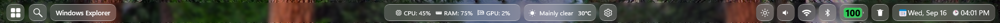

# OS27 Golden Gate theme for TopBar For Windhawk Mod

This Theme makes the TopBar look inspired to OS27 GoldenGate.

**Author**: [WasiXGamer](https://github.com/wasixgamer)




## Installation

To import the theme styles:

* Open the TopBar for Windhawk mod in Windhawk.
* Go to the "Settings" tab and select "Textual mode".
* Copy the content below to the text box and click "Save settings".

<details>
<summary>Content to import (click to expand)</summary>

```yaml

theme: 'OS27 GoldenGate'
controlStyles:
- target: Grid#BarRoot > Grid#TopBarRoot
  styles:
    - Background:=$GlassBlur
    - BorderThickness=1
    - CornerRadius=14
    - Margin=6,4,6,0

- target: Canvas > FlyoutPresenter > Grid > Border#PART_BackgroundBorder
  styles:
    - CornerRadius=20
    - BorderThickness=1

- target: FlyoutBlurHost
  styles:
    - Background:=$GlassBlur

- target: Canvas > MenuFlyoutPresenter > Grid > Border#PART_BackgroundBorder
  styles:
    - CornerRadius=20
    - Background:=$GlassBlur
    - BorderThickness=1

- target: StartButton, SearchButton
  styles:
    - Background:=$GlassTile
    - BorderBrush:=$GlassBorder
    - BorderThickness=1
    - CornerRadius=10
    - Margin=5,3,3,3

- target: TaskButton
  styles:
    - Background:=$GlassTile
    - BorderBrush:=$GlassBorder
    - BorderThickness=1
    - CornerRadius=10
    - Margin=3,3,3,3
- target: Button#AppTitleButton
  styles:
    - Background:=$GlassTile
    - BorderBrush:=$GlassBorder
    - BorderThickness=1
    - CornerRadius=10
    - Margin=3,3,3,3

- target: DisplayButton, SoundButton, WifiButton, BluetoothButton, ResourceButton, BatteryButton, WeatherButton, RecycleBinButton, SettingsButton
  styles:
    - Background:=$GlassTile
    - BorderBrush:=$GlassBorder
    - BorderThickness=1
    - CornerRadius=10
    - Margin=3,3,3,3

- target: ClockButton
  styles:
    - Background:=$GlassTile
    - BorderBrush:=$GlassBorder
    - BorderThickness=1
    - CornerRadius=10
    - Margin=3,3,3,3

- target: ClockButton
  styles:
    - Background:=$GlassTile
    - BorderBrush:=$GlassBorder
    - BorderThickness=1
    - CornerRadius=10
    - Margin=3,3,3,3
styleConstants:
  - GlassBlur=<WindhawkBlur BlurAmount="3" />
  - GlassTile=<WindhawkBlur BlurAmount="16" TintColor="#20FFFFFF" TintOpacity="0.2" />
  - GlassBorder=<LinearGradientBrush StartPoint="0.50,1.17" EndPoint="0.50,-0.17"><GradientStop Offset="0.09" Color="#C9FFFFFF"/><GradientStop Offset="0.46" Color="#001C1C1C"/><GradientStop Offset="0.49" Color="#001C1C1C"/><GradientStop Offset="0.91" Color="#A8FFFFFF"/></LinearGradientBrush>

```
</details>
