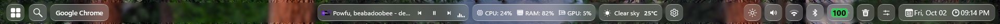

# OS27 Golden Gate theme for TopBar For Windows Mod

This Theme makes the TopBar look inspired to OS27 GoldenGate.

**Author**: [WasiXGamer](https://github.com/wasixgamer)




## Installation

To import the theme styles:

* Open the TopBar for Windhawk mod in Windhawk.
* Go to the "Settings" tab and select "Textual mode".
* Copy the content below to the text box and click "Save settings".

<details>
<summary>Content to import (click to expand)</summary>

```yaml

styleConstants:
  - 'GoldenGateBackground=<WindhawkBlur BlurAmount="16" TintColor="#20FFFFFF" TintOpacity="0.2" />'
  - 'GoldenGateBorder=<LinearGradientBrush StartPoint="0.50,1.17" EndPoint="0.50,-0.17"><GradientStop Offset="0.09" Color="#C9FFFFFF"/><GradientStop Offset="0.46" Color="#001C1C1C"/><GradientStop Offset="0.49" Color="#001C1C1C"/><GradientStop Offset="0.91" Color="#A8FFFFFF"/></LinearGradientBrush>'

controlStyles:
  - target: 'Grid#BarRoot > Grid#TopBarRoot'
    styles:
      - 'Background:=<WindhawkBlur BlurAmount="3" />'
      - BorderThickness=1
      - CornerRadius=14
      - Margin=6,4,6,0

  - target: FlyoutPresenter
    styles:
      - CornerRadius=20

  - target: 'FlyoutPresenter > Border#PART_BackgroundBorder'
    styles:
      - CornerRadius=20
      - BorderThickness=1

  - target: 'FlyoutPresenter > Border#PART_BackgroundBorder > ContentPresenter'
    styles:
      - CornerRadius=20

  - target: MenuFlyoutPresenter
    styles:
      - CornerRadius=20

  - target: 'MenuFlyoutPresenter > Border#PART_BackgroundBorder'
    styles:
      - CornerRadius=20
      - 'Background:=<WindhawkBlur BlurAmount="3" />'
      - BorderThickness=1

  - target: FlyoutBlurHost
    styles:
      - 'Background:=<WindhawkBlur BlurAmount="3" />'

  - target: 'StartButton, SearchButton'
    styles:
      - 'Background:=$GoldenGateBackground'
      - 'BorderBrush:=$GoldenGateBorder'
      - BorderThickness=1
      - CornerRadius=10
      - Margin=5,3,3,3

  - target: TaskButton
    styles:
      - 'Background:=$GoldenGateBackground'
      - 'BorderBrush:=$GoldenGateBorder'
      - BorderThickness=1
      - CornerRadius=10
      - Margin=3,3,3,3

  - target: Button#AppTitleButton
    styles:
      - 'Background:=$GoldenGateBackground'
      - 'BorderBrush:=$GoldenGateBorder'
      - BorderThickness=1
      - CornerRadius=10
      - Margin=3,3,3,3

  - target: 'DisplayButton, SoundButton, WifiButton, BluetoothButton, ResourceButton, BatteryButton, WeatherButton, RecycleBinButton, SettingsButton, ControlCenterButton'
    styles:
      - 'Background:=$GoldenGateBackground'
      - 'BorderBrush:=$GoldenGateBorder'
      - BorderThickness=1
      - CornerRadius=10
      - Margin=3,3,3,3

  - target: ClockButton
    styles:
      - 'Background:=$GoldenGateBackground'
      - 'BorderBrush:=$GoldenGateBorder'
      - BorderThickness=1
      - CornerRadius=10
      - Margin=3,3,3,3

  - target: MediaButton
    styles:
      - 'Background:=$GoldenGateBackground'
      - 'BorderBrush:=$GoldenGateBorder'
      - BorderThickness=1
      - CornerRadius=10
      - Margin=3,3,3,3

  - target: MediaTransportButton
    styles:
      - 'Background:=$GoldenGateBackground'
      - BorderThickness=1
      - CornerRadius=10
```
</details>
